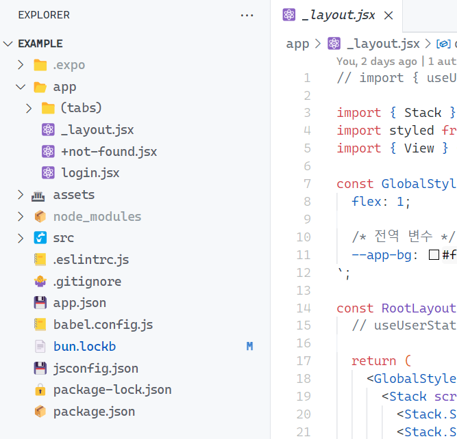

# 🥙 Cuescadilla Non Mono

Cuescadilla is a modified version of the Cascadia Mono font( https://github.com/microsoft/cascadia-code ), designed to provide a more versatile typeface for those who want to use Cascadia in environments beyond traditional code editors. This font retains the essence of the original Cascadia Mono while offering a selection of alphabetic characters, numbers, and special symbols in a non-monospace format.

## Features

- **Modified Characters**: A selection of alphabetic characters, numbers, and special symbols have been adjusted to create a non-monospace appearance.
- **Versatile Use**: Ideal for users who want to enjoy the aesthetic of Cascadia Mono in various applications, not just in code editors.

## Preview



## License

This font software is licensed under the SIL Open Font License, Version 1.1. For more details, please refer to the license file included in this repository.

## Installation

To install Cuescadilla Non Mono, simply download the font files and install.

```
font-family: 'Cuescadilla';
```
